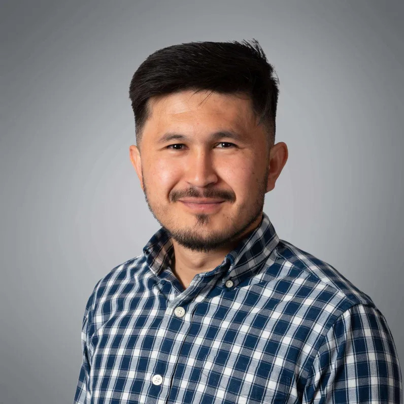

# Morteza Haidari
**Data Engineer - Software Developer**

Thore Ellingsens veg 9, 4352 Kleppe, Norway  
+47 40390704  
murtaza_haidari2008@hotmail.com  

---

## Profile
Dedicated Data Engineer with a proven track record in developing data-driven applications and enhancing system accessibility. Adept at building scalable and efficient applications. Possesses entrepreneurial acumen, demonstrated by the successful development and pitching of innovative projects.

---

## Experience

### 2023 - Present: Application Developer, Compendia AS, Bryne
- Maintained and optimized web applications, resulting in improved performance and user experience.
- Developed both front-end and back-end solutions using IBM (now HCL) Domino technology.

### 2021 - 2022: Trainee Developer, Tingtun AS, Lillesand
- Provided maintenance and enhancements for web applications, focusing on performance improvements.
- Developed user interfaces and backend systems using the Django framework.

---

## Education

### 2018 - 2022: Bachelor’s Degree in Data Engineering, University of Agder, Grimstad
- Specialized in software development, data analysis, and system optimization.
- Participated in the "UiA Nyskapning collaboration with 3 Day Startup" in 2019, where our team won the "3DS’s Steve Jobs Award" for our innovative project.

### 2022 - Present: Graduate Studies in Artificial Intelligence and Internet of Things, University of Agder, Grimstad
- Currently enrolled in advanced courses focused on DevOps and application development.
- Pursuing additional coursework to stay abreast of current technologies despite economic challenges.

---

## Professional Goals

### 2024 - 2027
- Achieve proficiency in advanced software development techniques.
- Obtain a Master’s Degree in a related field.

---

## Skills

**Programming Languages:**  
Python, C, C++, Arduino, Java, JavaScript, .NET

**Operating Systems:**  
Linux, macOS, Windows

**Tools and Technologies:**  
Git, API development, DevOps practices

**Development Methodologies:**  
Agile methodologies

**Soft Skills:**  
Strong problem-solving abilities, effective communication, adaptability, and teamwork

---

## Languages

**English:** Fluent  
**Norwegian:** Fluent  
**Dari:** Fluent  
**Spanish:** Basic proficiency  
**Mandarin:** Basic proficiency  

---

## Projects

GitHub School project repositories are available on GitHub and can be accessed upon request.

---

## Contact

**Email:** murtaza_haidari2008@hotmail.com  
**Phone:** +47 40390704  
**Address:** Thore Ellingsens veg 9, 4352 Kleppe, Norway

---

I agree to the processing of personal data provided in this document for realizing the recruitment process pursuant to the Personal Data Act of June 2018 and in agreement with Regulation (EU) 2016/679 of the European Parliament and of the Council of 27 April 2016 on the protection of natural persons with regard to the processing of personal data and on the free movement of such data, and repealing Directive 95/46/EC (General Data Protection Regulation).
